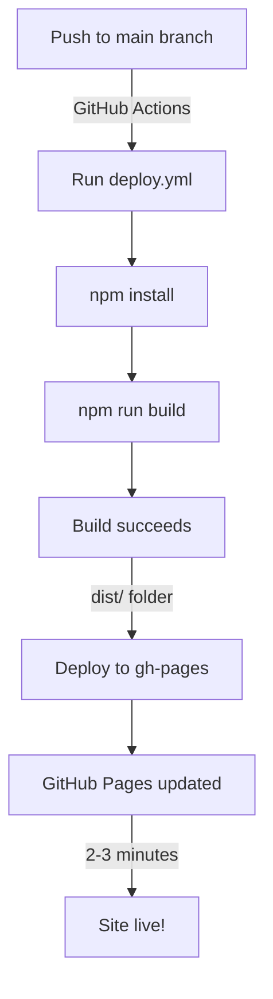

# 🔧 GitHub Pages Blank Page - Solution Summary

## The Problem ❌

Your site at https://mamati1379.github.io/star-style-barbershop/ was showing a **completely blank page**.

### Root Cause

```
.github/workflows/
├── deploy.yml         ✅ Correct
├── static.yml         ❌ WRONG (was being executed instead)
```

The `static.yml` workflow was:
- Uploading **raw source files** instead of built `dist/` folder
- **NOT running** `npm run build`
- Result: No JavaScript or CSS assets deployed → **Blank page**

---

## What Was Broken

| Component | Status | Issue |
|-----------|--------|-------|
| Vite base path | ✅ OK | `/star-style-barbershop/` configured correctly |
| Local build | ✅ OK | `npm run build` produces correct dist/ |
| GitHub Actions | ❌ BROKEN | `static.yml` uploading repo instead of dist/ |
| Asset URLs | ✅ OK | `dist/index.html` references correct paths |
| Font paths | ⚠️ RISKY | Relative paths could break with base path |

---

## The Solution ✅

### 1. Remove the Bad Workflow (Primary Fix)

**Deleted**: `.github/workflows/static.yml`

```diff
- .github/workflows/
  ├── deploy.yml         ✅ KEEP
-  └── static.yml        ❌ DELETE ← This was the problem!
```

**Why**: This file was uploading the entire repository instead of the built `dist/` folder. Now only `deploy.yml` runs, which:
1. Installs dependencies
2. Builds the project (`npm run build`)
3. Deploys `dist/` to `gh-pages` branch ✅

### 2. Fix Font Asset Paths (Secondary Fix)

**Updated**: `src/fonts.css`

```diff
- src: url("../fonts/IRANSansX-Regular.otf")
+ src: url("/star-style-barbershop/fonts/IRANSansX-Regular.otf")
```

**Why**: With the base path `/star-style-barbershop/`, relative paths don't work reliably. Absolute paths ensure fonts load correctly from the right location.

**Applied to**: All 10 font definitions in the file

---

## Before vs. After

```
BEFORE:
─────────────────────────────────────────────────────
GitHub Actions Workflow: static.yml (WRONG)
  ↓
Uploads entire repo (including source code)
  ↓
GitHub Pages serves raw files
  ↓
React app can't load JS/CSS
  ↓
Blank page ❌


AFTER:
─────────────────────────────────────────────────────
GitHub Actions Workflow: deploy.yml (CORRECT)
  ↓
1. npm install
2. npm run build → creates dist/
3. Deploys dist/ to gh-pages
  ↓
GitHub Pages serves built dist/ files
  ↓
React app loads correctly
  ↓
Working site ✅
```

---

## Deployment Flow (Now Fixed)



---

## Changes Made

### Files Deleted
- ❌ `.github/workflows/static.yml`

### Files Updated
- ✏️ `src/fonts.css` (10 font definitions, absolute paths)
- ✏️ `DEPLOYMENT.md` (troubleshooting added)

### Files Created
- 📄 `DEBUG_REPORT.md` (root cause analysis)
- 📄 `FIX_CHECKLIST.md` (step-by-step guide)
- 📄 `SOLUTION_SUMMARY.md` (this file)

---

## What You Need To Do

### ✅ Step 1: Verify Changes Locally
```bash
npm run build
# Should complete successfully with:
# ✓ Copied font: IRANSansX-*.otf
# ✓ built in X.XXs
```

### ✅ Step 2: Commit and Push
```bash
git add .
git commit -m "Fix: Remove conflicting static.yml workflow, fix font paths"
git push origin main
```

### ✅ Step 3: Monitor Deployment
- Go to: https://github.com/mamati1379/star-style-barbershop/actions
- Wait for "Deploy to GitHub Pages" to complete (2-3 minutes)
- Verify: ✅ Success status

### ✅ Step 4: Test the Site
- Hard refresh: `Cmd+Shift+R` (macOS) or `Ctrl+Shift+R` (Windows)
- Visit: https://mamati1379.github.io/star-style-barbershop/
- Check: Page loads (not blank) ✅

---

## Why This Actually Works

### The Key Insight

GitHub Pages had **TWO conflicting workflows** fighting over how to deploy:

| Workflow | Action | Priority | Problem |
|----------|--------|----------|---------|
| `deploy.yml` | Build → Deploy `dist/` | Lower | Correct but ignored |
| `static.yml` | Upload entire repo | Higher | Wrong but running |

**Solution**: Remove the wrong one. Now only the correct one runs. 🎯

### Asset Loading Chain (Now Working)

```
1. Browser requests: https://mamati1379.github.io/star-style-barbershop/
2. Serves: dist/index.html (from gh-pages branch) ✓
3. HTML references: /star-style-barbershop/assets/index-*.js
4. Browser requests: https://mamati1379.github.io/star-style-barbershop/assets/index-*.js
5. Serves: dist/assets/index-*.js (exists!) ✓
6. React app loads and renders ✓
7. Font references: /star-style-barbershop/fonts/IRANSansX-*.otf
8. Browser requests: https://mamati1379.github.io/star-style-barbershop/fonts/IRANSansX-*.otf
9. Serves: dist/fonts/IRANSansX-*.otf (exists!) ✓
10. Fonts render correctly ✓
```

---

## Expected Results After Deployment

### ✅ What Should Work
- Page is **not blank** → Shows UI ✓
- Text renders in **IRANSansX font** ✓
- **All assets load** (check Network tab in F12) ✓
- **No console errors** (check Console tab in F12) ✓
- **Interactive elements work** (click buttons, fill forms, etc.) ✓

### ❌ If Still Broken (unlikely)
Check `FIX_CHECKLIST.md` → Troubleshooting section

---

## Technical Details

### GitHub Pages Deployment Now Works Like This

```yaml
# .github/workflows/deploy.yml (the ONLY workflow now)
name: Deploy to GitHub Pages

on:
  push:
    branches: [main, master]

jobs:
  build-and-deploy:
    runs-on: ubuntu-latest
    steps:
      - uses: actions/checkout@v3
      - name: Setup Node.js
        uses: actions/setup-node@v4
        with:
          node-version: "22"
          cache: "npm"
      - name: Install dependencies
        run: npm install --legacy-peer-deps
      - name: Build
        run: npm run build      # ← Creates dist/ with all assets
      - name: Deploy to GitHub Pages
        uses: peaceiris/actions-gh-pages@v3
        with:
          github_token: ${{ secrets.GITHUB_TOKEN }}
          publish_dir: ./dist    # ← Deploys the built dist/
```

This workflow:
1. ✅ Installs dependencies
2. ✅ Builds the project (Vite + Tailwind)
3. ✅ Runs the custom font copy plugin
4. ✅ Deploys only the `dist/` folder to `gh-pages` branch
5. ✅ GitHub Pages serves from `gh-pages` branch

---

## Questions?

### Q: Will this break local development?
**A:** No. Your local build still works exactly the same way. This only affects GitHub Pages deployment.

### Q: Do I need to change anything else?
**A:** No. All other configuration is already correct:
- ✅ `vite.config.ts` has correct base path
- ✅ Public/dist folder structure is correct
- ✅ 404.html redirect is configured
- ✅ `.nojekyll` file is in place

### Q: How long until the site is live?
**A:** 
1. Push changes → 10 seconds
2. GitHub Actions runs → 2-3 minutes
3. Cache propagates → another 1-2 minutes
4. Total: **3-5 minutes**

### Q: What if it still doesn't work?
**A:** Refer to `FIX_CHECKLIST.md` → Troubleshooting section for detailed steps.

---

## Files Reference

| File | Purpose |
|------|---------|
| `SOLUTION_SUMMARY.md` | This file - overview of the fix |
| `DEBUG_REPORT.md` | Detailed root cause analysis |
| `FIX_CHECKLIST.md` | Step-by-step deployment guide |
| `DEPLOYMENT.md` | General deployment documentation |

---

**Status**: Ready for deployment! ✅  
**Time to fix**: ~3-5 minutes after push  
**Complexity**: Simple (workflow configuration issue, not code issue)
